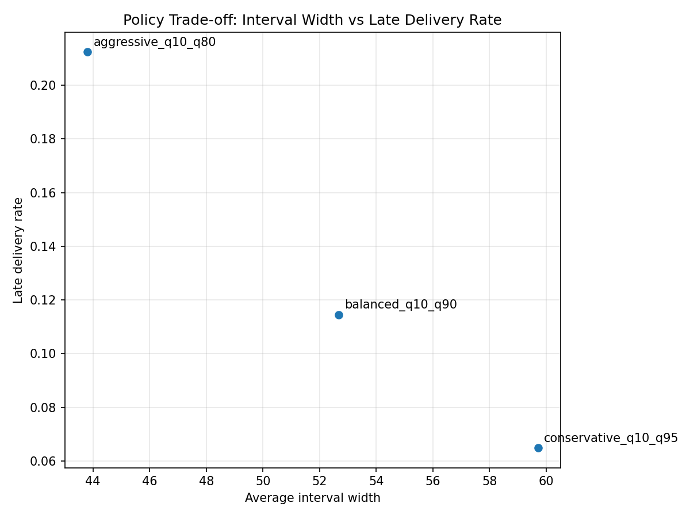

# Delivery Promise Optimization - Mercado Envíos

## Overview

This project implements a prototype system for delivery promise optimization in an e-commerce logistics platform.

At checkout, the system must display a delivery window such as:

```text
"Delivery today between 16:00 and 20:00"
```

This is a challenging problem because delivery time is uncertain. The system must balance:

- User experience: narrow, precise intervals
- Operational reliability: low probability of late deliveries

## Repository Goal
This repository implements a minimal prototype of the predictive and policy core of a delivery promise system. It demonstrates:

* uncertainty-aware lead-time prediction
* interval-based buyer promise construction
* policy trade-off analysis between precision and late-delivery risk

It is intentionally not a full logistics platform. The production ecosystem around data integration, online serving, monitoring, and operational workflows is documented conceptually rather than implemented in code.

## Key Idea

Instead of predicting a single delivery time, the system:

1. Estimates uncertainty in delivery lead time
2. Transforms uncertainty into a promise interval

This is achieved by separating the problem into two components:

- Predictive layer: estimates the distribution of delivery time
- Policy layer: selects the interval shown to the user

This separation enables explicit control over business trade-offs.

## Problem Formulation

For each order $i$:

**Target:**

$T_i$ = delivery lead time

**Model:**

$P(T_i | X_i)$

**Output:**

$[a_i, b_i]$ = delivery promise interval

The objective is to:

- minimize interval width
- while controlling late delivery probability

For a detailed mathematical formulation, see: [docs/problem_framing.md](docs/problem_framing.md)

## Modeling Approach

- Gradient Boosted Trees (LightGBM)
- Quantile regression to estimate:

$Q_{10}, Q_{25}, Q_{50}, Q_{80}, Q_{90}, Q_{95}$

This enables direct construction of prediction intervals.

For full modeling details, training setup, and alternatives, see: [docs/modeling.md](docs/modeling.md)

## Policy Layer

Intervals are generated using quantile-based policies:

- Conservative: $[Q_{10}, Q_{95}]$
- Balanced: $[Q_{10}, Q_{90}]$
- Aggressive: $[Q_{10}, Q_{80}]$

Each policy defines a different trade-off between:

- interval width
- late delivery rate

For a detailed discussion of policies, metrics, and trade-offs, see: [docs/policy_and_metrics.md](docs/policy_and_metrics.md)

## Dataset Strategy
The challenge does not provide operational marketplace data, so the project uses a hybrid proxy dataset design.

* A real trip-duration dataset is used to represent delivery travel time: the Kaggle NYC Taxi Trip Duration dataset.
* Synthetic seller-side variables are used to represent preparation time, pickup delay, and related operational uncertainty.

The final target is:

```text
lead_time_minutes =
prep_time_minutes
+ pickup_delay_minutes
+ delivery_duration_minutes
```

The synthetic components are explicit and configurable, which makes the prototype easier to inspect and reason about.

For a detailed description of the dataset construction process, see: [docs/dataset.md](docs/dataset.md)

## Dataset Summary

```text
Dataset size: 100,000 rows
Splits: 70,000 train / 15,000 validation / 15,000 test
Processed columns: 23
Model features: 17
Target: lead_time_minutes
Split strategy: time-aware
```

## System Overview


## Evaluation

Policies are evaluated using:

- Late delivery rate: $P(T > b)$
- Interval width: $b - a$
- Coverage: $P(a ≤ T ≤ b)$

The key result is a trade-off curve:

- x-axis: interval width
- y-axis: late delivery rate

This illustrates the Pareto frontier between precision and reliability.

## Key Result
The central result of the project is a policy trade-off plot where:

```text
x-axis: average interval width
y-axis: late delivery rate
```

<p align="center">
  
</p>

Each point is a different promise policy. Narrower intervals are more attractive from a customer-experience perspective, while wider intervals reduce the probability of missing the promised deadline.

With the current `q10`-based policies, the validation results illustrate that trade-off clearly:

* `aggressive_q10_q80` is narrowest but riskiest
* `balanced_q10_q90` is a middle ground
* `conservative_q10_q95` is safest but widest

## System Architecture

The system follows a standard ML architecture:

### Offline pipeline
- data processing
- feature engineering
- model training
- model registry

### Online pipeline
- checkout request
- feature retrieval
- model inference
- policy decision
- delivery promise

Designed for:

- low latency
- scalability
- monitoring and retraining

For a full system design, see: [docs/architecture.md](docs/architecture.md)

## Repository Structure

```text
mercado-envios-challenge/
├── config/         # dataset, modeling, and policy configuration
├── src/            # dataset construction, training, and evaluation scripts
├── docs/           # problem framing, modeling, assumptions, policy, and architecture narrative
├── notebooks/      # exploratory and presentation notebooks
├── data/           # local raw and processed data (not committed)
├── artifacts/      # local trained models and outputs
├── tests/          # lightweight unit tests
├── README.md
└── pyproject.toml
```

## How to Run

Example workflow using a local virtual environment:

```bash
# install dependencies
uv pip install -e ".[dev]"

# build proxy dataset
python -m src.build_dataset

# train point model
python -m src.train_model

# train quantile models
python -m src.train_quantiles

# evaluate promise policies
python -m src.evaluate_policy
```

## What This Repository Implements
* proxy dataset construction from public transport data plus synthetic marketplace variables
* baseline lead-time point prediction
* quantile-based interval prediction
* offline policy trade-off evaluation
* concise architecture and assumptions documentation

## What Is Not Implemented
* real-time feature pipelines
* production serving infrastructure
* dispatch or routing optimization
* online experimentation
* monitoring dashboards
* automated retraining orchestration
* seller communication and operational workflow tooling (see [docs/operational_modeling.md](docs/operational_modeling.md) for design discussion)

## Key Assumptions

- Delivery time can be approximated from observable features
- Proxy dataset approximates real-world dynamics
- Quantile regression provides sufficient uncertainty estimates

See [docs/assumptions.md](docs/assumptions.md) for details.

## Limitations

- Synthetic dataset components
- No real-time operational signals
- Static policy (same for all orders)

This is a prototype, not a production system.

## Key Takeaways

* The problem is not just prediction, but decision under uncertainty
* Separating prediction and policy enables flexibility
* Quantile regression provides a simple and effective solution
* The system exposes a clear business trade-off

## Future Work

* Conformal prediction for calibrated intervals
* Dynamic policies per order
* Integration with dispatch and routing systems
* Reinforcement learning for policy optimization

## Notes

This project was developed as part of the Mercado Libre Delivery Promise challenge.

The goal is to demonstrate:

* problem formulation
* modeling decisions
* system design thinking
* ability to connect ML to business impact
