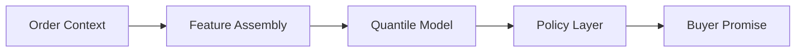

# Mercado Libre Delivery Promise Optimization Prototype

Uncertainty-aware delivery promise modeling with quantile prediction and policy trade-off analysis.

## Challenge Overview
Marketplace platforms show buyers delivery promises such as "Today between 16:00 and 20:00." Those promises need to balance two competing goals: they should feel precise and useful to the buyer, but they also need to be operationally reliable enough to avoid late deliveries.

This challenge is not only about predicting a single delivery time. It asks for a combination of problem formulation, modeling approach, architecture thinking, and a small practical implementation. The central idea in this repository is that delivery promises should be treated as a decision problem informed by uncertainty-aware prediction.

## Repository Goal
This repository implements a minimal prototype of the predictive and policy core of a delivery promise system. It demonstrates:

* uncertainty-aware lead-time prediction
* interval-based buyer promise construction
* policy trade-off analysis between precision and late-delivery risk

It is intentionally not a full logistics platform. The production ecosystem around data integration, online serving, monitoring, and operational workflows is documented conceptually rather than implemented in code.

## Core Idea
The prototype models delivery lead time as a distribution rather than a single timestamp. The workflow is:

1. predict delivery lead-time uncertainty
2. extract useful quantiles of that distribution
3. convert those quantiles into buyer-facing promise intervals
4. compare policies that trade off narrower windows against safer delivery commitments

```text
lead_time =
prep_time
+ pickup_delay
+ delivery_duration
```

This separation between prediction and policy is the main design idea of the project. The model estimates uncertainty. The policy layer decides how that uncertainty should be exposed to the buyer.

## System Overview



## Dataset Strategy
The challenge does not provide operational marketplace data, so the project uses a hybrid proxy dataset design.

* A real trip-duration dataset is used to represent delivery travel time: the Kaggle NYC Taxi Trip Duration dataset.
* Synthetic seller-side variables are used to represent preparation time, pickup delay, and related operational uncertainty.

The final target is:

```text
lead_time_minutes =
prep_time_minutes
+ pickup_delay_minutes
+ delivery_duration_minutes
```

The synthetic components are explicit and configurable, which makes the prototype easier to inspect and reason about.

## Modeling Approach
### Point prediction model
The baseline point model uses `LightGBMRegressor` to estimate expected lead time. Its role is to confirm that the proxy dataset contains learnable signal and to provide a benchmark against simpler baselines.

### Quantile models
Separate LightGBM quantile models are trained for:

```text
q10
q50
q80
q90
q95
```

These quantiles support interval-based delivery promises and allow downstream policy evaluation without retraining a model for every decision rule.

## Policy Layer
The buyer-facing interval is determined by policy choices built on top of the predicted quantiles. With the current configuration, the repository evaluates:

```text
[q10, q80]
[q10, q90]
[q10, q95]
```

Each policy trades off:

* interval width
* late delivery risk

This is the core decision layer of the prototype: the same predictive model can support more aggressive or more conservative promise strategies.

## Evaluation Metrics

Policies are compared using operationally interpretable metrics:

• **Late delivery rate**  
  `P(T > promise_end)`

• **Interval width**  
  `promise_end − promise_start`

• **Coverage**  
  `P(promise_start ≤ T ≤ promise_end)`

• **Early-before-start rate**  
  `P(T < promise_start)`

These metrics capture the trade-off between operational reliability and buyer-facing precision.

## Key Result
The central result of the project is a policy trade-off plot where:

```text
x-axis: average interval width
y-axis: late delivery rate
```


Each point is a different promise policy. Narrower intervals are more attractive from a customer-experience perspective, while wider intervals reduce the probability of missing the promised deadline.

With the current `q10`-based policies, the validation results illustrate that trade-off clearly:

* `aggressive_q10_q80` is narrowest but riskiest
* `balanced_q10_q90` is a middle ground
* `conservative_q10_q95` is safest but widest

## Repository Structure
```text
mercado-envios-challenge/
├── config/         # dataset, modeling, and policy configuration
├── src/            # dataset construction, training, and evaluation scripts
├── docs/           # problem framing, assumptions, and architecture narrative
├── notebooks/      # exploratory and presentation notebooks
├── data/           # local raw and processed data (not committed)
├── artifacts/      # local trained models and outputs (not committed)
├── tests/          # lightweight unit tests
├── README.md
└── pyproject.toml
```

Directory roles:

* `src/` -> modeling and evaluation scripts
* `config/` -> reproducible configuration files
* `docs/` -> business framing and production narrative
* `notebooks/` -> result inspection and presentation
* `tests/` -> focused validation of core dataset invariants

## Project Stages
```text
Stage 0 — Problem framing
Stage 1 — Repository scaffold
Stage 2 — Proxy dataset construction
Stage 3 — Lead time point prediction
Stage 4 — Quantile interval prediction
Stage 5 — Policy trade-off analysis
Stage 6 — Architecture narrative
Stage 7 — Final packaging
```

Only Stages 2–5 contain substantive implementation code. The other stages define the framing, repository structure, and documentation needed to make the prototype coherent and reviewable.

## How to Run the Project
Example workflow using a local virtual environment:

```bash
# install dependencies
uv pip install -e ".[dev]"

# build proxy dataset
python -m src.build_dataset

# train point model
python -m src.train_model

# train quantile models
python -m src.train_quantiles

# evaluate promise policies
python -m src.evaluate_policy
```

The main result-inspection notebook is `notebooks/results_demo.ipynb`. It reads already-generated artifacts and is intended for presentation, not training.

## What This Repository Implements
* proxy dataset construction from public transport data plus synthetic marketplace variables
* baseline lead-time point prediction
* quantile-based interval prediction
* offline policy trade-off evaluation
* concise architecture and assumptions documentation

## What Is Not Implemented
* real-time feature pipelines
* production serving infrastructure
* dispatch or routing optimization
* online experimentation
* monitoring dashboards
* automated retraining orchestration
* seller communication and operational workflow tooling

## Key Assumptions
The most important assumptions are:

* public trip-duration data is an acceptable transport proxy for the prototype
* seller-side uncertainty can be approximated synthetically
* lead time can be modeled as additive components
* quantile-based intervals are a reasonable first approximation to promise policies

Full details are documented in `docs/assumptions.md`.

## Architecture Overview
The prototype represents the predictive and policy core of a broader delivery-promise system. In a production version, upstream seller, order, logistics, and geographic signals would feed an online feature assembly layer; a quantile prediction service would estimate uncertainty; and a policy layer would choose the buyer-facing interval shown in the product.

The repository only implements the offline prototype of that flow. The conceptual production narrative is documented in `docs/architecture.md`.

## Final Takeaway
This project is a compact applied ML prototype for delivery promise optimization. It demonstrates sound problem framing, uncertainty-aware modeling, policy-driven decision making, and production-aware system design while staying intentionally limited in scope and easy to review.
