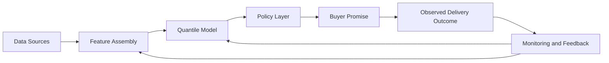

# Architecture Narrative

## 1. Purpose of the Architecture
This document explains how the prototype implemented in this repository could fit into a broader production delivery-promise system. The code in the repository is intentionally narrow: it implements a proxy dataset, point and quantile prediction models, and offline policy comparison.

The architecture described here is conceptual rather than deployed. Its purpose is to demonstrate system thinking around how a marketplace logistics platform could operationalize prediction and policy logic, not to claim a full production implementation.

## 2. System Goal
A marketplace or logistics platform needs to show the buyer a delivery promise such as "Today between 16:00 and 20:00." Producing that promise reliably requires combining information from seller operations, order context, courier and logistics state, geographic conditions, and current demand pressure.

The production goal is not only to estimate how long delivery might take. The system must convert uncertain operational outcomes into a buyer-facing interval that balances customer experience against operational reliability. That is the same business problem defined in the Stage 0 framing, now viewed from a system-design perspective.

## 3. High-Level Architecture Overview
At a high level, a production system of this type would include six conceptual layers:

1. data sources that capture seller, order, logistics, temporal, and geographic signals
2. feature or signal preparation that assembles a prediction-ready view of the current order context
3. a prediction layer that estimates lead-time point forecasts and quantiles
4. a policy layer that converts uncertainty into a buyer-facing promise interval
5. a serving layer that returns the promise to the product surface with low enough latency for checkout or browsing
6. monitoring and feedback loops that track operational outcomes and feed future retraining and policy adjustments

This repository implements a prototype of the predictive and policy core. A real production system would require upstream operational data integration, online feature assembly, monitoring, retraining processes, and fallback behavior that are described here conceptually but not built in code.

## 4. Data Sources
In production, the system would likely consume several groups of upstream signals.

### Seller-side signals
Relevant seller-side inputs include historical preparation times, SLA performance, seller category, warehouse or store location, and current backlog or operational load. These help explain whether an order is likely to be prepared quickly or slowly and how much seller-specific uncertainty is present.

### Order-level signals
Useful order inputs include item category, basket size or order complexity, special handling requirements, and fulfillment type. These signals affect both average processing time and the likelihood of long-tail delays.

### Logistics and courier signals
The serving system would ideally incorporate courier availability, pickup queue state, local network congestion, and routing or hub information. These signals are especially important for estimating pickup delay and delivery-time risk under current operating conditions.

### Temporal and geographic signals
Time-of-day, day-of-week, holidays, events, pickup and delivery zones, and distance or travel-time estimates all influence lead time. They provide structure for repeated demand and congestion patterns across the network.

The prototype only approximates a subset of this landscape. It uses a hybrid proxy dataset in which transport duration is represented by public taxi-trip data and seller-side behavior is synthetically generated. That simplification is deliberate: it isolates the predictive and policy problem without claiming to replicate full marketplace operations.

## 5. Offline Training Layer
The prototype's training scripts map naturally to a conceptual offline training workflow. In production, historical order outcomes would be collected from operational systems, joined with seller, logistics, and temporal features, and assembled into a training dataset with consistent feature definitions.

That offline process would include time-aware train, validation, and test splits; point-model training for baseline estimation; quantile-model training for interval prediction; and offline policy evaluation to understand the trade-off between narrow promises and late deliveries. Before a model or policy update is promoted, the system would compare it against previous versions using recent backtests and reliability diagnostics.

In this repository, those responsibilities are represented locally by `src/build_dataset.py`, `src/train_model.py`, `src/train_quantiles.py`, and `src/evaluate_policy.py`. The production equivalents would likely run on a schedule, register versioned artifacts, and enforce stronger training-inference consistency guarantees, but the core conceptual steps are already visible in the prototype.

## 6. Online Inference / Serving Flow
In a production environment, a delivery-promise request could follow a sequence like this:

1. a buyer loads a product or checkout page
2. the system gathers current order, seller, and logistics context
3. a feature service assembles the prediction-ready feature vector
4. the quantile prediction model estimates lead-time quantiles
5. the policy layer transforms those quantiles into a buyer-visible interval
6. the frontend displays the promise

This separation is important. The model predicts uncertainty, for example by returning quantiles such as `q10`, `q50`, `q90`, and `q95`. The policy layer then decides what to show the buyer, such as a narrower or wider interval depending on reliability goals. In other words, prediction and decision policy are related but distinct production responsibilities.

Latency matters in practice because the promise often needs to be returned during browsing or checkout, but the main design point here is conceptual rather than infrastructural: online serving needs a fast path from feature assembly to quantile prediction to policy selection and then to product display.

## 7. Policy Layer in Production
A quantile model alone does not decide what promise the buyer should see. The policy layer determines how the predicted uncertainty is operationalized. In a production setting, that decision might depend on service-level objectives, seller reliability, customer experience goals, regional constraints, and marketplace strategy.

For example, an unreliable seller or high-risk region might require a more conservative interval. A consistently fast and predictable seller category could support a narrower promise. Peak periods may justify switching to safer policies to avoid a spike in late deliveries.

The key design idea is that the ML model estimates uncertainty, while the policy layer chooses how aggressively or conservatively to expose that uncertainty to the buyer. This repository's Stage 5 policy evaluation script is a prototype of that decision layer, but only in offline analysis form.

## 8. Monitoring and Feedback
A real system would need monitoring across operational, modeling, and business dimensions.

### Operational monitoring
Important operational signals include late-delivery rate, promise-hit rate, interval-width trends, and SLA compliance by region or seller segment. These metrics tell the business whether promises are both safe and useful.

### Model monitoring
The prediction stack would also need calibration and drift monitoring. Relevant checks include prediction-error drift, upper-quantile calibration, feature missingness, and distribution shifts in major drivers such as seller behavior, demand timing, or trip distance.

### Business monitoring
From a product perspective, the system would ideally be observed alongside checkout conversion, cancellation rate, and customer satisfaction or complaint signals. A promise policy that is operationally safe but commercially weak is still suboptimal.

None of these monitoring components are implemented in the repository. They are omitted intentionally, but they are critical for any production deployment of this kind.

## 9. Retraining and Model Lifecycle
Production models would evolve over time rather than remain static. A realistic lifecycle would include periodic retraining on recent data, time-aware validation to reduce leakage, backtesting before promotion, model versioning, and rollback to a previous stable model or policy if performance deteriorates.

The specific tooling is not the important part here. The important point is that a delivery-promise system needs explicit lifecycle management because seller behavior, operational conditions, and demand patterns all change over time.

## 10. Failure Modes and Safeguards
Several production failure modes are plausible. Upstream features may be missing or stale. Seller behavior may shift quickly. Demand surges can change the distribution of delays. Quantile calibration may drift, especially in the upper tail. A business team could also deploy an overly aggressive policy that narrows windows too far and increases late deliveries.

Lightweight safeguards would therefore be important. Examples include conservative default intervals when features are incomplete, minimum and maximum allowed promise widths, degraded-mode heuristics, monitoring alerts for late-rate spikes, and the ability to roll back to a safer policy or previous model version. These safeguards are not implemented in the repo, but they are realistic extensions of the policy and monitoring logic the prototype is designed to explore.

## 11. Mapping Prototype Components to Production
The repository artifacts map to production roles as follows:

* `src/build_dataset.py` -> offline dataset assembly prototype
* `src/train_model.py` -> offline point-model training baseline
* `src/train_quantiles.py` -> offline uncertainty-estimation prototype
* `src/evaluate_policy.py` -> offline policy comparison prototype
* `artifacts/point_model/` -> versioned baseline-model outputs
* `artifacts/quantile_model/` -> versioned quantile-model outputs
* `artifacts/policy_analysis/` -> offline decision-policy evaluation outputs
* `docs/problem_framing.md` -> business framing and predictive-versus-policy decomposition
* `docs/architecture.md` -> conceptual production system narrative
* `docs/assumptions.md` -> explicit prototype assumptions and their risks

This mapping makes the intended scope clear: the code implements a core slice of the system, while the documentation explains where that slice would sit in a broader platform.

## 12. Scope Boundaries
Several elements are intentionally out of scope for this repository:

* real-time feature storage and streaming infrastructure
* dispatch or routing optimization
* courier assignment logic
* seller notification workflows
* production API deployment
* online experimentation or A/B testing infrastructure
* production monitoring dashboards
* automated retraining orchestration

These omissions are deliberate rather than accidental. The prototype is designed to focus on one coherent problem slice: uncertainty-aware prediction and policy evaluation for delivery promises.

## 13. Conclusion
This repository implements the core predictive and policy logic of a delivery-promise system in prototype form. The surrounding architecture narrative shows how that logic could connect to a realistic production marketplace environment, while keeping a clear distinction between what is implemented here and what a full operational system would require.
